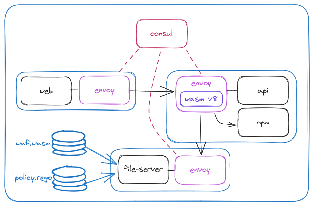

# Consul Extensions Demo

This project demonstrates using Consul Envoy extensions with Consul on Kubernetes:
- OPA integration via `builtin/ext-authz`
- Wasm integration via `builtin/wasm`



## Requirements

- `consul` >= `v1.16.0`
- `consul-k8s` >= `v1.2.0`
- `docker`
- `jq`
- `kind`

# Deployment

<details>
<summary>Create k8s cluster</summary>

This command executes a script that runs a local docker registry and creates a `kind` cluster that can pull images from that registry.
This can be useful during development or debugging if you need to use a local dev image for any of the containers.

The local registry is not required when using published container images.

```shell
./kind-with-rgy
```
</details>


<details>
<summary>Build Consul Enterprise</summary>

This step is only necessary while work is in progress and there is a need to be able to pull dev images.
This is unnecessary when using published container images.

```shell
cd consul-enterprise/
make dev-docker
docker tag consul-dev localhost:5000/consul-dev-ent
docker push localhost:5000/consul-dev-ent
```

or

```shell
( cd ~/github.com/hashicorp/consul-enterprise/ && make dev-docker && docker tag consul-dev localhost:5000/consul-dev-ent && docker push localhost:5000/consul-dev-ent )
```
</details>


<details>
<summary>Setup Secrets</summary>

```shell
rm -rf secrets
mkdir secrets
echo -n "1111111-2222-3333-4444-555555555555" > secrets/root-token.txt
echo -n "$(consul keygen)" > secrets/gossip-key.txt
(cd secrets ; consul tls ca create)
chmod 600 secrets/*
```

Create a k8s secret for the Consul data

```shell
kubectl create secret generic consul \
  --from-file=root-token=secrets/root-token.txt \
  --from-file=gossip-key=secrets/gossip-key.txt \
  --from-file=ca-cert=secrets/consul-agent-ca.pem \
  --from-file=ca-key=secrets/consul-agent-ca-key.pem \
  --from-file=enterprise-license=${CONSUL_LICENSE_PATH}
```
</details>

<details>
<summary>Configure Volume for Service Wasm and OPA Data</summary>

```shell
kubectl apply -f pv/pv.yaml
kubectl apply -f pv/pvc.yaml
```
</details>

<details>
<summary>Install Consul using `consul-k8s`</summary>

```shell
consul-k8s install -config-file values.yaml -namespace default -auto-approve
```
</details>

### 

<details>
<summary>Install the apps</summary>

```shell
kubectl apply -f apps/1-install/fs.yaml
kubectl apply -f apps/1-install/api.yaml
kubectl apply -f apps/1-install/web.yaml
kubectl apply -f apps/1-install/intentions.yaml
kubectl apply -f apps/1-install/service-defaults.yaml
```
</details>

<details>
<summary>Configure the Environment</summary>

Using the `env.sh` script.

```shell
. env.sh
```

The `env.sh` script does the following:

```shell
# consul cli
export CONSUL_HTTP_TOKEN='1111111-2222-3333-4444-555555555555'
export CONSUL_HTTP_ADDR=localhost:8501
export CONSUL_HTTP_SSL=true
export CONSUL_HTTP_SSL_VERIFY=false
```

```shell
# apps
export API_APP=$(kubectl get pods | grep 'api-' | awk '{print $1}')
export WEB_APP=$(kubectl get pods | grep 'web-' | awk '{print $1}')
```
</details>


<details>
<summary>Port Forwards</summary>

```shell
# Consul :8501
kubectl port-forward services/consul-server 8501

# web :9090
kubectl port-forward services/web 9090

# api Envoy admin :19000
kubectl port-forward pods/$API_APP 19000
```

</details>

<details>
<summary>Test out the Consul install</summary>

```shell
consul catalog services
```

Browse to the [Consul UI](https://localhost:8501)

</details>

<details>
<summary>Test out the apps</summary>


Browse to the [Web app UI](http://localhost:9090/ui)

```shell
# exec into the web pod to directly call the api pod
kubectl exec -it pod/$WEB_APP -c web -- ash

# good actor
curl 'http://api.default.svc.cluster.local/'

# bad actor requests - these will succeed

# attempted SQL injection
curl -v 'http://api.default.svc.cluster.local/' -d'1%27%20ORDER%20BY%203--%2B'

# attempted JS injection
curl -v 'http://api.default.svc.cluster.local/?arg=<script>alert(0)</script>'
```
</details>


# WAF Wasm Extension

<details>
<summary>Get the Coraza WAF</summary>

```shell
curl -sSL -o extensions/tmp.zip https://github.com/corazawaf/coraza-proxy-wasm/releases/download/0.1.0/coraza-proxy-wasm-0.1.0.zip \
  && unzip -o extensions/tmp.zip -d extensions \
  && rm extensions/tmp.zip \
  && sha256sum extensions/coraza-proxy-wasm.wasm
```

Copy the SHA256 checksum, we'll need it for the next step.

</details>


<details>
<summary>Add the Wasm Envoy extension to the `api` app</summary>

```shell
code apps/2-wasm/service-defaults.yaml
kubectl apply -f apps/2-wasm/service-defaults.yaml
```

</details>

<details>
<summary>Demo WAF in the data path</summary>

```shell
# exec into the web pod to directly call the api pod
kubectl exec -it pod/$WEB_APP -c web -- ash

# good actor
curl 'http://api.default.svc.cluster.local/'

# bad actor requests - will be rejected by WAF with 403 Forbidden

# attempted SQL injection
curl -v 'http://api.default.svc.cluster.local/' -d'1%27%20ORDER%20BY%203--%2B'

# attempted JS injection
curl -v 'http://api.default.svc.cluster.local/?arg=<script>alert(0)</script>'
```

</details>


# Open Policy Agent

<details>
<summary>Deploy OPA agent sidecar to the `api` app</summary>

```shell
kubectl apply -f apps/3-opa/api.yaml
. env.sh
kubectl describe pods/${API_APP}
```

</details>

<details>
<summary>Apply the `ext_authz` extension to enable OPA</summary>

```shell
kubectl apply -f apps/3-opa/service-defaults.yaml
```

</details>

<details>
<summary>Test OPA policy enforcement</summary>

Ensure that we're only permitted to read (method = `GET`) resources from the `api` during the hours of the demo.
Writes (method = `POST`) are not permitted.

```shell
code extensions/policy.rego

# read OK
curl -v 'http://api.default.svc.cluster.local/'
# write NOK
curl -v -XPOST 'http://api.default.svc.cluster.local/'
```

</details>

# Observability

<details>
<summary>Extension Stats</summary>

```shell
# Wasm
curl -s localhost:19000/stats/prometheus | grep waf_filter
curl -s localhost:19000/stats | grep wasm
```

```shell
# OPA
curl -s localhost:19000/stats | grep 'ext_authz\.response'

# TODO create pretty jq filter for grok'ing opa logs
# Nice to have: a `result` object describing the "why" for a response
```

</details>

<details>
<summary>Envoy filters</summary>

```shell
curl -sS localhost:19000/config_dump | jq --raw-output '.configs[2].dynamic_listeners[] | .active_state.listener.filter_chains[].filters[] | select(.name == "envoy.filters.network.http_connection_manager") | .typed_config.http_filters[] | select(.name == "envoy.filters.http.ext_authz")'
curl -sS localhost:19000/config_dump | jq --raw-output '.configs[2].dynamic_listeners[] | .active_state.listener.filter_chains[].filters[] | select(.name == "envoy.filters.network.http_connection_manager") | .typed_config.http_filters[] | select(.name == "envoy.filters.http.wasm")'
```

</details>

# Troubleshooting

<details>
<summary>Error Categories</summary>

There are two general categories of errors related to the Envoy extensions:
1. **Configuration errors** - These are errors that Consul can catch through validation when the configuration entry is applied. Configuration errors result in a log message and API response. The config entry will not be written and the proxy will not be updated.
   - **Symptom**: Config entry is not applied.
   - **Diagnosis**: Consul responds with a detailed error message on write.
     - Consul CLI/HTTP API: Error is written to the console.
     - CRD: Error shows up in the resource: `kubectl describe service-defaults/<name>`
   - **Solution**: Fix the configuration, as instructed, and reapply.
2. **Runtime errors** - These are errors that Consul can only catch at runtime when it attempts to apply the Envoy extension to the proxy. At this point the config entry has been written but there is a problem applying the configuration. This will result in a log message and the configuration will not be applied to the proxy. For example, if the extension requires an upstream but no upstream is defined. These are more difficult to notice and diagnose.
   - **Symptom**: Configuration is written but the service is not behaving as expected.
   - **Diagnosis**:
     - **Consul logs** - Check the logs on the Consul agent. Look for errors relating to extensions.
     - **`consul-dataplane` logs** - Check the logs on the `consul-dataplane`. Look for Envoy errors relating to the extensions.
     - **Dump the Envoy config** - Dump the Envoy configuration and check for the expected filter.
   - **Solution**: Fix the error and reapply the configuration.

</details>

<details>
<summary>Reset to base install</summary>

```shell
kubectl apply -f apps/1-install/service-defaults.yaml
```

</details>

<details>
<summary>Configuration Errors</summary>

```shell
code apps/4-troubleshooting/config-err-service-defaults.hcl

# Consul CLI
consul config write apps/4-troubleshooting/config-err-service-defaults.hcl

# K8s CRD
kubectl apply -f apps/4-troubleshooting/config-err-service-defaults.yaml
kubectl describe service-defaults/api
```

</details>

<details>
<summary>Runtime Errors</summary>


```shell
code apps/4-troubleshooting/runtime-err-service-defaults.yaml

kubectl apply -f apps/4-troubleshooting/runtime-err-service-defaults.yaml
kubectl describe service-defaults/api # resource sync'd w/o errors

# Diagnosis
## Try some curl commands from `web`
## If the extensions are working correctly, we expect 403 responses
## Spoiler, we're going to get 200 responses
## May need to try a couple of times to clear the response cache
curl -v 'http://api.default.svc.cluster.local/' -d'1%27%20ORDER%20BY%203--%2B'
curl -v -XPOST 'http://api.default.svc.cluster.local/'

# dump the envoy config for the HTTP filters on the `public_listener`
curl -sS localhost:19000/config_dump | jq --raw-output '.configs[2].dynamic_listeners[] | .active_state.listener.filter_chains[].filters[] | select(.name == "envoy.filters.network.http_connection_manager") | select(.typed_config.route_config.name == "public_listener") | .typed_config.http_filters'

# Consul server logs
kubectl logs consul-server-0

# `consul-dataplane` logs
kubectl logs $API_APP -c consul-dataplane
```

</details>

<details>
<summary>Restore valid configuration</summary>


```shell
kubectl apply -f apps/4-troubleshooting/service-defaults.yaml
```

</details>


# Clean up

<details>
<summary>Clean up the demo</summary>

```shell
kind delete cluster
docker stop kind-registry
```

</details>
